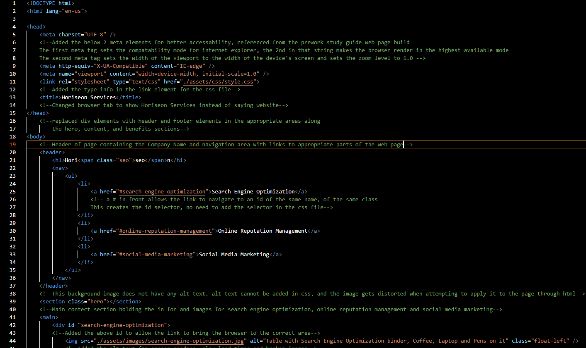
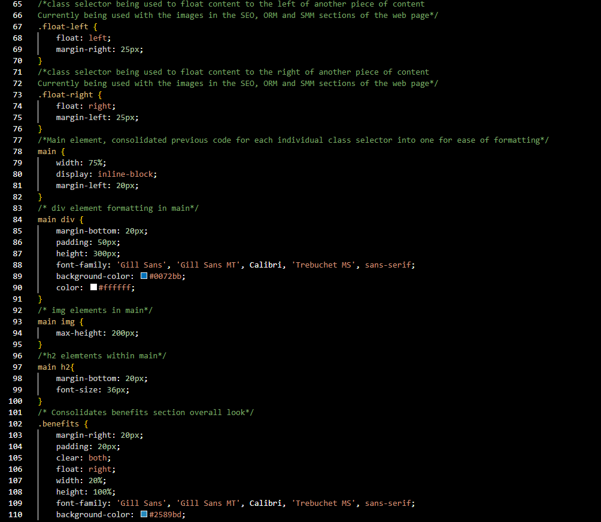

# <Horiseon-Refactor>

## Decription
    - Horiseon, a marketing agency wanted to make sure that their code base was meeting accessibility standards for search engine optimization.
    - This project was built to allow Horiseon to grow in the marketing world and compete with their peers.
    - This project was able to solve broken links on the nav bar, corrected the missing semantic html and css standards that allow for Search Engine Optimaztion to be utilized to its fullest. Notes were also added to the css file for ease of viewing for future coding changes.
    - I learned how to link a clickable link to another part of the page. I learned how to look at code that is already written and assess how it can be consolidated, or written differenlty such as with semantic elements to allow Search Engine Optimiaztion to function better, and for a future developer looking at the code, to better understand each areas purpose and or functionality.

## Instalation
    Web Page is in the link below
    [Horiseon Marketing](https://neglon.github.io/horiseon-refactor/#search-engine-optimization)

## Usage
    Upon visiting the page, clicking any of the links on the nav bar on the top right of the page will relocate the your viewing location on the page to the appropriate section.
   
    
   
    
   

## Credits
    N/A

## Liscence
    N/A